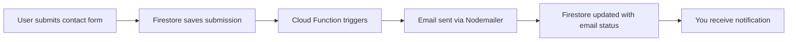

# 🎉 Complete Cloud Functions Email System Setup

## 🚀 What's Been Created

Your portfolio now has a **professional email notification system** that automatically sends you emails when someone submits the contact form!

### 📁 Files Created:

```
📂 Cloud Functions Structure:
├── functions/
│   ├── index.js              # Main email notification functions
│   ├── package.json          # Dependencies and scripts
│   └── .eslintrc.js          # Code linting configuration
├── firebase.json             # Firebase project configuration
├── .firebaserc              # Project settings
├── setup-email.bat          # Windows email setup script
├── setup-email.sh           # Linux/Mac email setup script
├── EMAIL_SETUP_GUIDE.md     # Detailed email configuration guide
└── DEPLOYMENT_GUIDE.md      # Step-by-step deployment instructions
```

### 🔧 Functions Created:

1. **`sendContactEmail`** - Automatically triggered when new contact is submitted
   - Sends beautifully formatted HTML email
   - Updates Firestore document with email status
   - Includes all contact details and timestamps

2. **`testEmail`** - Testing function to verify email setup
   - Call manually to test email configuration
   - Helps troubleshoot email issues

## 📧 Email Features

Your email notifications include:
- ✅ **Professional HTML formatting** with your portfolio colors (#0A192F, #64FFDA)
- ✅ **Complete contact details** (name, email, subject, message)
- ✅ **Timestamp tracking** of submission
- ✅ **Portfolio branding** with custom styling
- ✅ **Plain text fallback** for compatibility
- ✅ **Automatic status tracking** in Firestore

## 🛠 Next Steps to Complete Setup

### Step 1: Gmail App Password
1. Enable 2-Factor Authentication on Gmail
2. Go to Google Account → Security → App passwords
3. Generate app password for "Mail"
4. Copy the 16-character password

### Step 2: Configure Email Credentials
**Option A - Use the setup script:**
```cmd
setup-email.bat
```

**Option B - Manual configuration:**
```bash
firebase functions:config:set gmail.user="your-email@gmail.com"
firebase functions:config:set gmail.password="your-16-char-app-password"
```

### Step 3: Deploy Functions
```bash
# Authenticate with Firebase
firebase login

# Deploy the functions
firebase deploy --only functions
```

### Step 4: Test Everything
1. Submit a contact form on your portfolio
2. Check your email for the notification
3. Verify Firestore shows `emailSent: true`

## 🎯 How It Works



### Flow Details:
1. **User Action**: Someone fills out your contact form
2. **Data Storage**: Contact details saved to Firestore `contactSubmissions` collection
3. **Function Trigger**: `sendContactEmail` function automatically triggered
4. **Email Processing**: Nodemailer formats and sends professional email
5. **Status Update**: Firestore document updated with email delivery status
6. **Notification**: You receive the formatted email notification

## 📊 What You'll Receive

When someone contacts you, you'll get an email like this:

```
Subject: 🚀 New Portfolio Contact: [Their Name]

📧 Professional HTML email containing:
• Contact person's name and email
• Subject line they provided
• Their full message
• Timestamp of submission
• Portfolio branding and styling
• Direct reply-to functionality
```

## 💰 Cost Information

- **Free Tier**: 125K function invocations/month (contact forms easily stay within this)
- **After Free**: $0.40 per million invocations
- **Typical Usage**: Personal portfolios rarely exceed free limits
- **Required Plan**: Firebase Blaze (pay-as-you-go)

## 🔧 Troubleshooting Resources

### Documentation Created:
- **`EMAIL_SETUP_GUIDE.md`** - Complete email configuration guide
- **`DEPLOYMENT_GUIDE.md`** - Step-by-step deployment instructions
- **Setup scripts** - Automated credential configuration

### Common Issues:
- **Authentication errors** → Verify Gmail app password
- **Deployment fails** → Check Firebase login and billing plan
- **No emails received** → Test with `testEmail()` function first

## 🎉 Benefits of This Setup

✅ **Professional**: No more checking Firestore manually for new contacts
✅ **Automatic**: Emails sent immediately when forms are submitted
✅ **Detailed**: Rich HTML formatting with all contact information
✅ **Reliable**: Uses Gmail's robust email infrastructure
✅ **Trackable**: Firestore tracks email delivery status
✅ **Branded**: Emails match your portfolio's visual design
✅ **Scalable**: Handles multiple contacts efficiently

## 🚀 Ready to Deploy?

1. **Read**: `DEPLOYMENT_GUIDE.md` for detailed steps
2. **Setup**: Run `setup-email.bat` to configure credentials
3. **Deploy**: `firebase deploy --only functions`
4. **Test**: Submit a contact form and check your email!

---

**Your portfolio now has enterprise-level contact management! 🎯**

Never miss another potential client or collaboration opportunity - every contact form submission will land directly in your inbox with all the details you need to respond professionally.

**Questions?** Check the detailed guides:
- 📧 Email Setup: `EMAIL_SETUP_GUIDE.md`
- 🚀 Deployment: `DEPLOYMENT_GUIDE.md`
